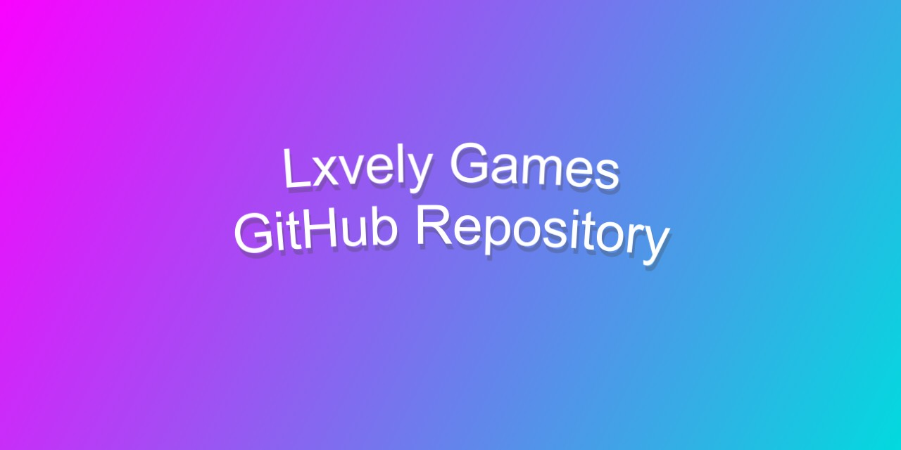

# Lxvely Games GitHub Repository 
#### A GitHub repository for the Roblox group Lxvely Games!
You can find scripts for our models and plugins here. *(Games are not included.)*

[Group](https://www.roblox.com/groups/8768440/Lxvely-Games#!/about) / [Discord](https://discord.gg/gXnQsR7su3) / [GitHub Page](https://jacobhumston.github.io/LxvelyGames/) / [License](https://github.com/jacobhumston/LxvelyGames/blob/Main/LICENSE) / [Code Of Conduct](https://github.com/jacobhumston/LxvelyGames/blob/Main/CODE_OF_CONDUCT.md)

**Feel free to make a [pull request](https://github.com/jacobhumston/LxvelyGames/pulls) or an [issue](https://github.com/jacobhumston/LxvelyGames/issues)!**

Currently this repository is only written in [Lua](https://www.lua.org/).
```lua
function kindmessage()
  print("Have a nice day! :)")
end
```

## Version Table
Name | Type | Version
------------ | ------------ | ------------
[SignPlugin](https://www.roblox.com/library/6304018498) | Plugin | V1
[ObbyStarterKit](https://www.roblox.com/library/6516383538/) | Model | V1.2

## Extra

- [[Discord.Js v11.6] Random Response Examples.](https://gist.github.com/jacobhumston/08c5f7adf32368bb01d164faeed5acc5)
- Cats: Extras/RandomCatPics/

